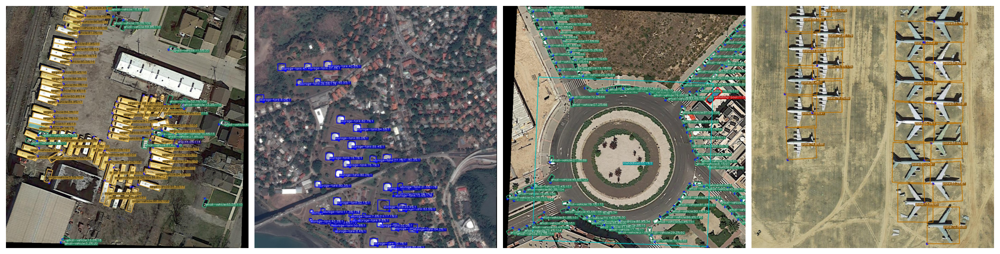

<div align="center"></div>


## Introduction
YOLO RTX is an anchor-free and oriented object detection version of YOLO, with a simpler design but better performance! It aims to bridge the gap between research and industrial communities.
For more YOLOX details, please refer to our [report on Arxiv](https://arxiv.org/abs/2107.08430).

This repo is an implementation of PyTorch version YOLOX and add CSL rotated branch.


## Quick Start

<details>
<summary>Installation</summary>

Step1. Install YOLOX.
```shell
git clone git@github.com:Megvii-BaseDetection/YOLOX.git
cd YOLOX
pip3 install -U pip && pip3 install -r requirements.txt
pip3 install -v -e .  # or  python3 setup.py develop
```

Step2. Install [pycocotools](https://github.com/cocodataset/cocoapi).

```shell
pip3 install cython; pip3 install 'git+https://github.com/cocodataset/cocoapi.git#subdirectory=PythonAPI'
```

</details>

<details>
<summary>Demo</summary>

Step1. Download a pretrained model from the benchmark table.

Step2. Use either -n or -f to specify your detector's config. For example:

```shell
python tools/demo.py image -n yolox-s -c /path/to/your/yolox_s.pth --path assets/dog.jpg --conf 0.25 --nms 0.45 --tsize 640 --save_result --device [cpu/gpu]
```
or
```shell
python tools/demo.py image -f exps/default/yolox_s.py -c /path/to/your/yolox_s.pth --path assets/dog.jpg --conf 0.25 --nms 0.45 --tsize 640 --save_result --device [cpu/gpu]
```
Demo for video:
```shell
python tools/demo.py video -n yolox-s -c /path/to/your/yolox_s.pth --path /path/to/your/video --conf 0.25 --nms 0.45 --tsize 640 --save_result --device [cpu/gpu]
```


</details>

<details>
<summary>Reproduce our results on COCO</summary>

Step1. Prepare COCO dataset
```shell
cd <YOLOX_HOME>
ln -s /path/to/your/COCO ./datasets/COCO
```

Step2. Reproduce our results on COCO by specifying -n:

```shell
python tools/train.py -n yolox-s -d 8 -b 64 --fp16 -o [--cache]
                         yolox-m
                         yolox-l
                         yolox-x
```
* -d: number of gpu devices
* -b: total batch size, the recommended number for -b is num-gpu * 8
* --fp16: mixed precision training
* --cache: caching imgs into RAM to accelarate training, which need large system RAM. 

When using -f, the above commands are equivalent to:
```shell
python tools/train.py -f exps/default/yolox_s.py -d 8 -b 64 --fp16 -o [--cache]
                         exps/default/yolox_m.py
                         exps/default/yolox_l.py
                         exps/default/yolox_x.py
```
  
**Multi Machine Training**

We also support multi-nodes training. Just add the following args:
* --num\_machines: num of your total training nodes
* --machine\_rank: specify the rank of each node

Suppose you want to train YOLOX on 2 machines, and your master machines's IP is 123.123.123.123, use port 12312 and TCP.  
On master machine, run
```shell
python tools/train.py -n yolox-s -b 128 --dist-url tcp://123.123.123.123:12312 --num-machines 2 --machine-rank 0
```
On the second machine, run
```shell
python tools/train.py -n yolox-s -b 128 --dist-url tcp://123.123.123.123:12312 --num-machines 2 --machine-rank 1
```

</details>


<details>
<summary>Evaluation</summary>

We support batch testing for fast evaluation:

```shell
python tools/eval.py -n  yolox-s -c yolox_s.pth -b 64 -d 8 --conf 0.001 [--fp16] [--fuse]
                         yolox-m
                         yolox-l
                         yolox-x
```
* --fuse: fuse conv and bn
* -d: number of GPUs used for evaluation. DEFAULT: All GPUs available will be used.
* -b: total batch size across on all GPUs

To reproduce speed test, we use the following command:
```shell
python tools/eval.py -n  yolox-s -c yolox_s.pth -b 1 -d 1 --conf 0.001 --fp16 --fuse
                         yolox-m
                         yolox-l
                         yolox-x
```

</details>


<details>
<summary>Tutorials</summary>

*  [Training on custom data](docs/train_custom_data.md)
*  [Manipulating training image size](docs/manipulate_training_image_size.md)

</details>

## Deployment


1.  [MegEngine in C++ and Python](./demo/MegEngine)
2.  [ONNX export and an ONNXRuntime](./demo/ONNXRuntime)
3.  [TensorRT in C++ and Python](./demo/TensorRT)
4.  [ncnn in C++ and Java](./demo/ncnn)
5.  [OpenVINO in C++ and Python](./demo/OpenVINO)


## Third-party resources
* The ncnn android app with video support: [ncnn-android-yolox](https://github.com/FeiGeChuanShu/ncnn-android-yolox) from [FeiGeChuanShu](https://github.com/FeiGeChuanShu)
* YOLOX with Tengine support: [Tengine](https://github.com/OAID/Tengine/blob/tengine-lite/examples/tm_yolox.cpp) from [BUG1989](https://github.com/BUG1989)
* YOLOX + ROS2 Foxy: [YOLOX-ROS](https://github.com/Ar-Ray-code/YOLOX-ROS) from [Ar-Ray](https://github.com/Ar-Ray-code)
* YOLOX Deploy DeepStream: [YOLOX-deepstream](https://github.com/nanmi/YOLOX-deepstream) from [nanmi](https://github.com/nanmi)
* YOLOX ONNXRuntime C++ Demo: [lite.ai](https://github.com/DefTruth/lite.ai/blob/main/ort/cv/yolox.cpp) from [DefTruth](https://github.com/DefTruth)
* Converting darknet or yolov5 datasets to COCO format for YOLOX: [YOLO2COCO](https://github.com/RapidAI/YOLO2COCO) from [Daniel](https://github.com/znsoftm)

## Cite YOLOX
If you use YOLOX in your research, please cite our work by using the following BibTeX entry:

```latex
 @article{yolox2021,
  title={YOLOX: Exceeding YOLO Series in 2021},
  author={Ge, Zheng and Liu, Songtao and Wang, Feng and Li, Zeming and Sun, Jian},
  journal={arXiv preprint arXiv:2107.08430},
  year={2021}
}
```

## Install
```shell
sudo apt-get install swig -y

conda create --name yolox python=3.7 -y

conda activate yolox

pip install torch==1.8.1+cu111 torchvision==0.9.1+cu111 torchaudio==0.8.1 -f https://download.pytorch.org/whl/torch_stable.html

pip install -U pip && pip install -r requirements.txt

pip install -v -e .  # or  python3 setup.py develop

pip install cython; pip install 'git+https://github.com/cocodataset/cocoapi.git#subdirectory=PythonAPI'

cd DOTA_devkit

swig -c++ -python polyiou.i

python setup.py build_ext --inplace

cd ../yolox/utils/iou

swig -c++ -python polyiou.i

python setup.py build_ext --inplace

cd ../Rotated_IoU/cuda_op

python setup.py install

export TORCH_CUDA_ARCH_LIST="7.5"
```

## DOTA datasets
PATH
```shell
cd DOTA_devkit
```
Step 1. Split
```shell
python ImgSplit_multi_process.py
```

Step 2. DOTA format to YOLO format
```shell
python YOLO_Transform.py
```

Step 3. YOLO format to COCO format
```shell
python darknet2coco.py  --data_path YOLO2COCO/gen_config.data
```

## train
```shell
python tools/train.py -f exps/rotation/yolortx_m.py -d 1 -b 4 --fp16
```

## demo
```shell
python tools/detect.py -f exps/rotation/yolortx_m.py -c YOLOX_outputs/yolortx_m/epoch_300_ckpt.pth --path ./DOTA_devkit/example/train_split/images/P0706__1.0__0___0.png 
```

